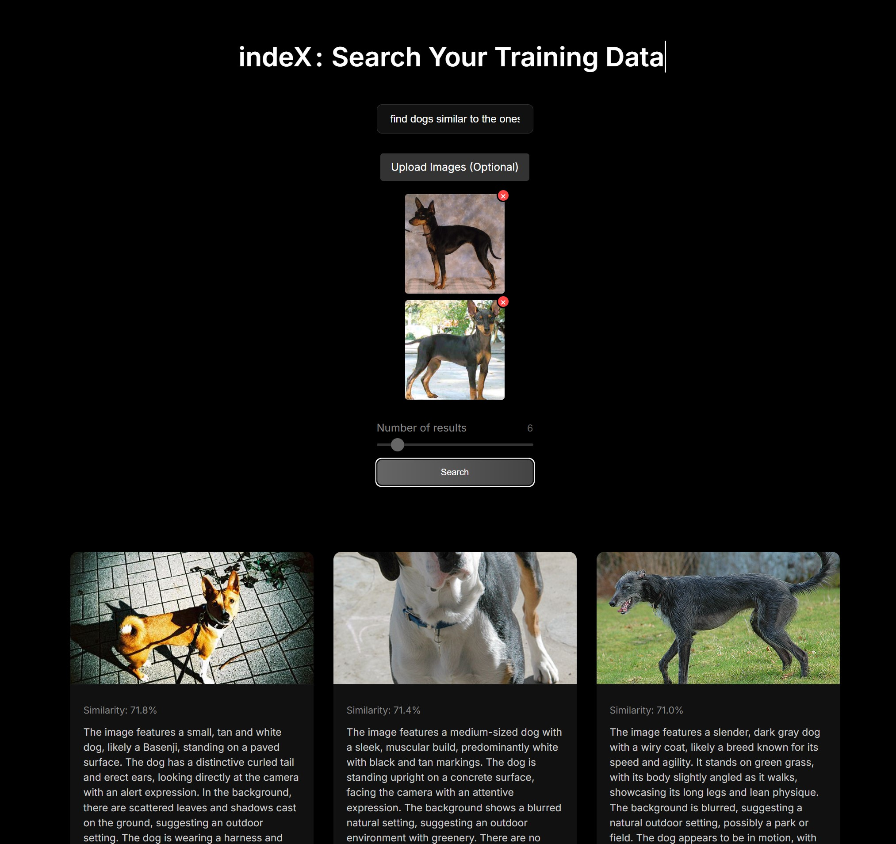
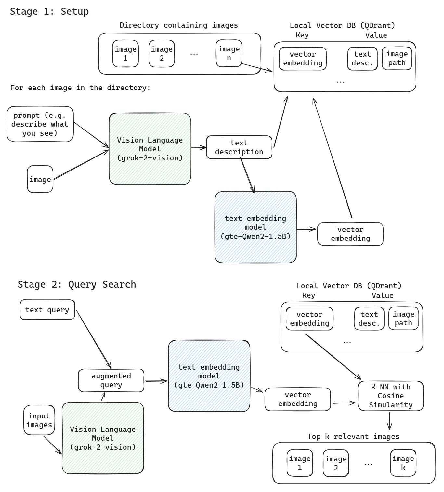

# indeX
Search your training data with indeX - an efficient vector search solution for your AI training data.
It's easy to setup and works on any directory with images.




### Setup

```bash
./setup.sh
```

Create a .env file in the root directory with the following variables (see .env_sample):

```bash
API_PROVIDER=OPENAI # OPENAI or XAI
XAI_API_KEY=YOUR_XAI_KEY
OPENAI_API_KEY=YOUR_OPENAI_KEY
```

### Quick Start with Sample Data
```bash
docker pull qdrant/qdrant
docker run -p 6333:6333 qdrant/qdrant
python app.py image-test
```

### System Design

indeX uses a vision language model (VLM) and a text embedding model store your training data embeddings. Here's how it works:

